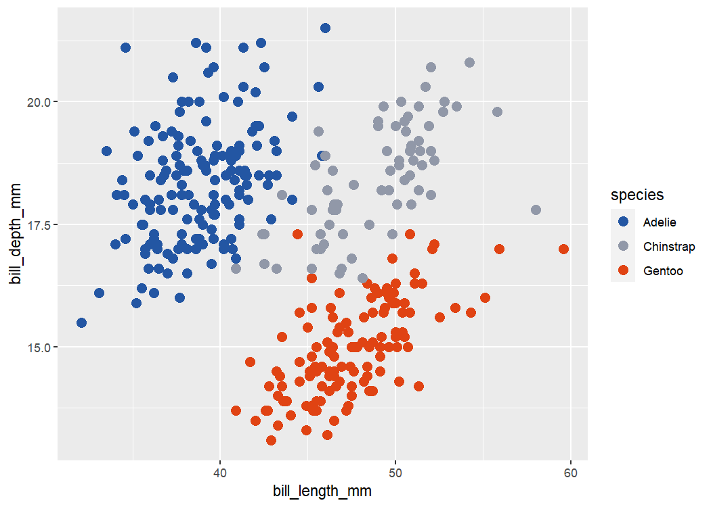
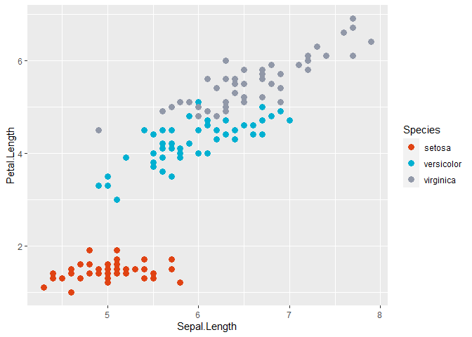
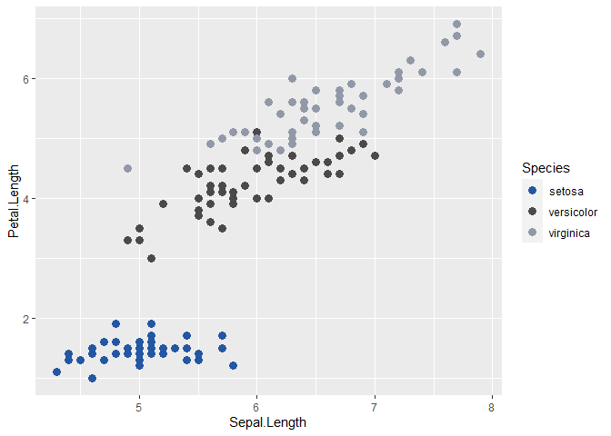
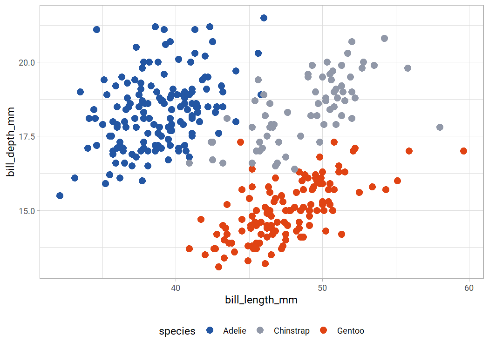
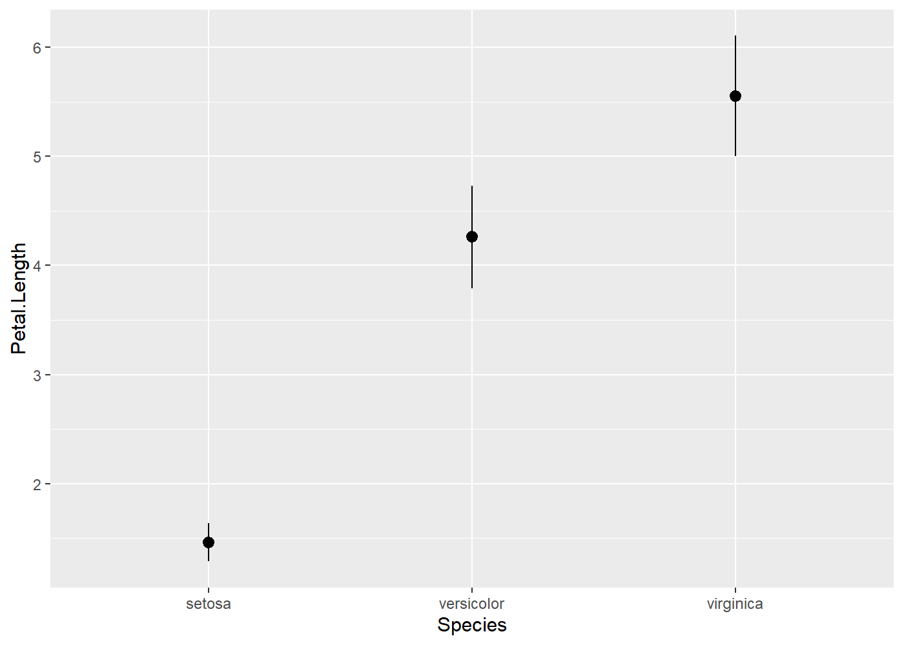

# benelib

The `benelib` contains some helper functions for commonly executed
tasks, and thus a convenient workflow in R.

It can be downloaded, installed and finally loaded via

``` r
remotes::install_github("benediktclaus/benelib")

library(benelib)
```

## Color schemes

There are color schemes for the PedScience Vestische Forschungs-gGmbH,
the Kinderpalliativzentrum, and Deutsches Kinderschmerzzentrum in
Datteln for `ggplot2`.

Those can be used via `scale_color_*` oder `scale_fill_*` and the
respective name of the color scheme’s institution. Those can be mapped
to continuous variables as well.

``` r
ggplot(iris, aes(x = Sepal.Length, y = Petal.Length, color = Species)) +
  geom_point(size = 3) +
  scale_color_pedscience()
```

<!-- -->

All of those contain six different palettes to fulfill everyone’s needs.

``` r
ggplot(iris, aes(x = Sepal.Length, y = Petal.Length, color = Species)) +
  geom_point(size = 3) +
  scale_color_pedscience(palette = "bright")
```

<!-- -->

``` r
ggplot(iris, aes(x = Sepal.Length, y = Petal.Length, color = Species)) +
  geom_point(size = 3) +
  scale_color_pedscience(palette = "decent")
```

<!-- -->

## Helper Functions

To plot means and their accompanied standard deviations, a common task
in psychotherapy and medical research, is a bit of a hassle in
`ggplot2`. Without computing these values yourself, you will need to use
the function `stat_summary()`. This itself then uses the function
`mean_sdl()` from the `MASS` package. This function, however, turns out
to plot the mean and a range of 2 standard deviations above and below it
by default. This can be changed with a rather lot of code

``` r
ggplot(iris, aes(x = Species, y = Petal.Length)) +
  stat_summary(fun.data = "mean_sdl", geom = "pointrange", fun.args = list(mult = 1))
```

<!-- -->

To simplify this, and to be sure to plot the desired range of 1 standard
deviation, the function `mean_sd()` can be used.

``` r
ggplot(iris, aes(x = Species, y = Petal.Length)) +
  stat_summary(fun.data = "mean_sd", geom = "pointrange")
```

<!-- -->
