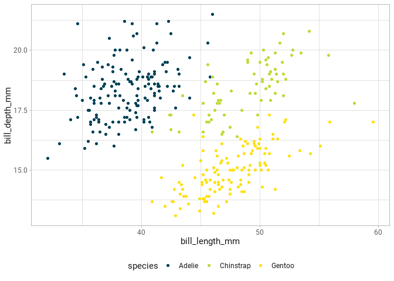

<!-- README.md is generated from README.Rmd. Please edit that file -->

# benelib 

<!-- badges: start -->

[](https://github.com/benediktclaus/benelib/actions)
<!-- badges: end -->

## My personal R library

The goal of `benelib` is to make my life considerably easier. This
package includes various helper functions for `ggplot2` plots, RStudio
projects or R Markdown templates and a few things more.

## Installation

You can install and loaded the released version of `benelib` from
[GitHub](https://github.com/) with:

``` r
# install.packages("devtools")
devtools::install_github("benediktclaus/benelib")
library(benelib)
```

## Examples

### Color and fill scales

One of the main reasons for this package to exist is the abilty to
change `ggplot2`’s default color and fill scales to a given corporate
design.

``` r
library(ggplot2)

palmer_penguins %>% 
  ggplot(aes(bill_length_mm, bill_depth_mm, color = species)) +
  geom_point() +
  scale_color_personal()
```



### Plot themes

Another nice addition is my personal `ggplot2` theme.

``` r
palmer_penguins %>% 
  ggplot(aes(bill_length_mm, bill_depth_mm, color = species)) +
  geom_point() +
  scale_color_personal() +
  theme_bene()
```


